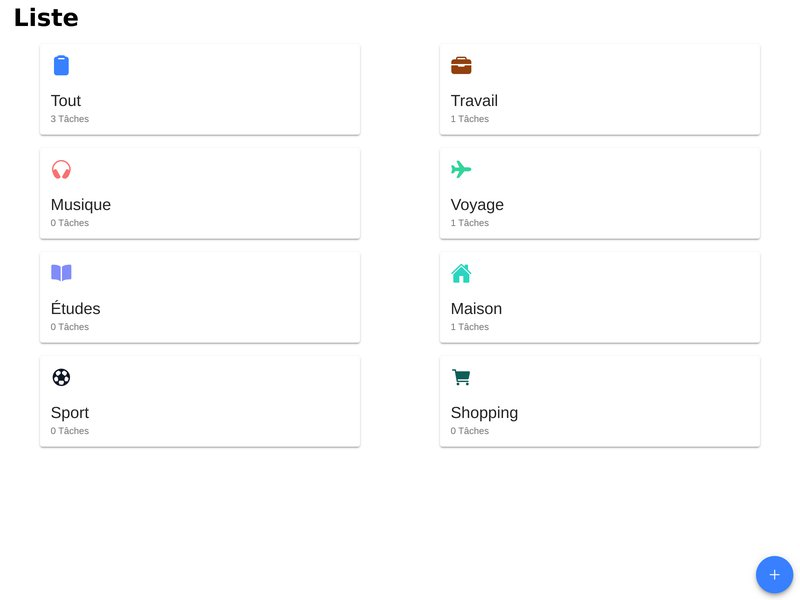

# 📝 TodoList VueJS– Application de gestion de tâches

**VueJS TodoList** est un projet web interactif développé avec le framework **Vue.js**.  
Ce projet m’a permis de découvrir le fonctionnement de Vue et d’apprendre à construire une application modulaire et réactive pour la gestion des tâches à accomplir.

---


---

## 🚀 Fonctionnalités

- ✅ Ajouter une tâche
- 🛠️ Modifier une tâche
- ❌ Supprimer une tâche
- 🔁 Interface utilisateur dynamique et réactive
- 🔧 Architecture modulaire basée sur les composants Vue

---

## 🧱 Technologies utilisées

- **Framework** : [Vue.js](https://vuejs.org/)  
- **Gestion des dépendances** : NPM  
- **Bundler & outils de build** : Webpack  
- **Langages** : HTML5, CSS3, JavaScript (ES6+)

---

## 📦 Installation & Lancement


# Cloner le projet

```bash
git clone https://github.com/ton-utilisateur/Todolist.git
cd Todolist
```
# Installer les dépendances

```bash
npm install
```
# Lancer le serveur de développement

```bash
npm run serve
```

L’application sera accessible sur : http://localhost:8080
