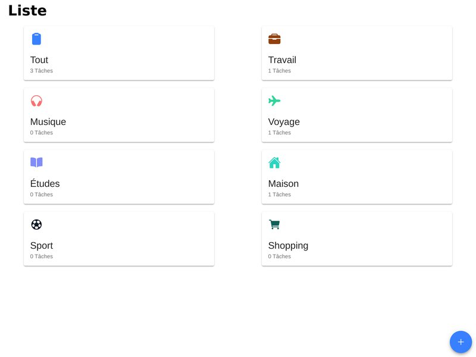

# 📝 TodoList VueJS – Application de gestion de tâches

**VueJS TodoList** est une application web de gestion de tâches développée avec **Vue.js**, **Ionic Vue** et **Firebase**.

Ce projet m’a permis d’apprendre à construire une application moderne, modulaire et réactive avec :
- Vue 3
- Vite
- Firebase
- Docker
- Ionic Vue

---



---

# 🚀 Fonctionnalités

- ✅ Ajouter une tâche
- 🛠️ Modifier une tâche
- ❌ Supprimer une tâche
- 🔁 Interface dynamique et réactive
- ☁️ Sauvegarde des données avec Firebase
- 📱 Interface basée sur Ionic Vue
- 🐳 Déploiement avec Docker

---

# 🧱 Technologies utilisées

- **Frontend** : Vue.js 3
- **UI Framework** : Ionic Vue
- **Backend / Base de données** : Firebase
- **Bundler** : Vite
- **Conteneurisation** : Docker & Nginx
- **Langages** : HTML5, CSS3, TypeScript, JavaScript

---

# 📦 Installation & Lancement

## 1️⃣ Cloner le projet

```bash
git clone https://github.com/ton-utilisateur/Todolist.git
cd Todolist
```

---

# 🔥 Configuration Firebase

L'application utilise Firebase.

## 2️⃣ Créer un projet Firebase

1. Créer un compte sur Firebase :
👉 https://firebase.google.com/

2. Créer un nouveau projet Firebase

3. Ajouter une application Web au projet

4. Récupérer les variables de configuration Firebase

---

## 3️⃣ Créer le fichier `.env`

Le projet contient un fichier `.env.test` servant de modèle.

Créer le fichier `.env` à partir du fichier d’exemple :

```bash
cp .env.test .env
```

---

## 4️⃣ Remplir les variables Firebase

Ouvrir le fichier `.env` puis remplacer les valeurs par celles fournies par Firebase :

```env
VITE_FIREBASE_API_KEY=
VITE_FIREBASE_AUTH_DOMAIN=
VITE_FIREBASE_PROJECT_ID=
VITE_FIREBASE_STORAGE_BUCKET=
VITE_FIREBASE_MESSAGING_SENDER_ID=
VITE_FIREBASE_APP_ID=
```

---

# 🐳 Lancement avec Docker

## 5️⃣ Construire l’image Docker

```bash
docker build -t todolist-app .
```

---

## 6️⃣ Lancer le conteneur

```bash
docker run -p 8080:80 todolist-app
```

---

# 🌐 Accès à l’application

L’application sera accessible à l’adresse suivante :

👉 http://localhost:8080

---

# 🛠️ Développement local

## Installer les dépendances

```bash
npm install
```

---

## Lancer le serveur de développement

```bash
npm run dev
```

---

# 📄 Licence

Projet réalisé dans un but pédagogique et de démonstration.