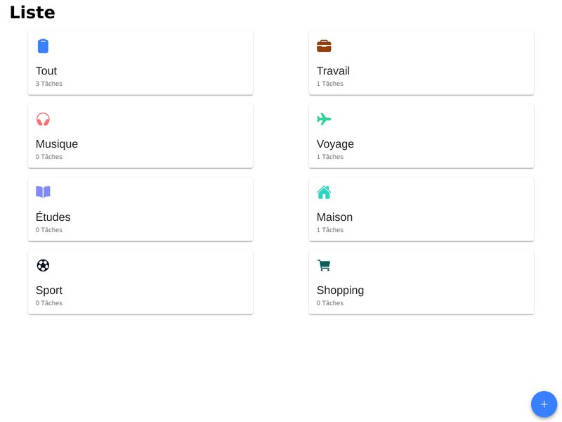

# 📝 TodoList VueJS – Application de gestion de tâches



## 📌 Nom du projet
**TodoList VueJS**

---

## 📄 Description courte
Application web et mobile réactive de gestion de tâches développée avec Vue 3, Ionic et Pinia. Elle permet de gérer facilement ses tâches au quotidien grâce à une interface intuitive et une synchronisation des données en temps réel via Firebase. Conteneurisée avec Docker, l'application est facilement déployable.

---

## 📖 Description détaillée
Ce projet d'application de gestion de tâches a été conçu pour mettre en pratique une architecture front-end moderne, modulaire et hautement performante.

S'appuyant sur **Vue 3** et le bundler **Vite**, l'application exploite **Pinia** pour une gestion centralisée et fluide de l'état de l'application, ainsi qu'**Ionic Vue** pour offrir un rendu visuel adapté aux interfaces mobiles et web. La persistance et la synchronisation des données sont assurées par un backend **Firebase**. Pour garantir un déploiement homogène et simplifié, le projet intègre un environnement de conteneurisation automatisé avec **Docker** et un serveur **Nginx**.

---

## ✨ Fonctionnalités du projet
- ➕ **Gestion complète des tâches (CRUD)** : Ajout, modification, consultation et suppression de tâches en temps réel.
- 📱 **Interface dynamique & réactive** : Expérience utilisateur fluide et adaptative développée avec Vue 3 et Ionic.
- ☁️ **Persistance dans le Cloud** : Sauvegarde, synchronisation et stockage des données via Firebase.
- 🧠 **Gestion d'état centralisée** : Architecture propre grâce à Pinia pour la gestion du flux de données.
- 🐳 **Déploiement conteneurisé** : Configuration Docker et Nginx prête pour la production et le développement local.

---

## 🧱 Technologies utilisées

- **Frontend** : Vue.js 3
- **UI Framework** : Ionic Vue
- **Gestion d’état** : Pinia
- **Backend / Base de données** : Firebase
- **Bundler** : Vite
- **Conteneurisation** : Docker & Nginx
- **Langages** : HTML5, CSS3, TypeScript, JavaScript

---

## 📦 Installation & Lancement

### 1️⃣ Cloner le projet

```bash
git clone https://github.com/Anatoleaze/Todolist.git
cd Todolist
```

---

## 🔥 Configuration Firebase

L'application utilise Firebase.

### 2️⃣ Créer un projet Firebase

1. Créer un compte sur Firebase :
👉 https://firebase.google.com/

2. Créer un nouveau projet Firebase

3. Ajouter une application Web au projet

4. Récupérer les variables de configuration Firebase

---

### 3️⃣ Créer le fichier `.env`

Le projet contient un fichier `.env.test` servant de modèle.

Créer le fichier `.env` à partir du fichier d’exemple :

```bash
cp .env.test .env
```

---

### 4️⃣ Remplir les variables Firebase

Ouvrir le fichier `.env` puis remplacer les valeurs par celles fournies par Firebase :

```env
VITE_FIREBASE_API_KEY=
VITE_FIREBASE_AUTH_DOMAIN=
VITE_FIREBASE_PROJECT_ID=
VITE_FIREBASE_STORAGE_BUCKET=
VITE_FIREBASE_MESSAGING_SENDER_ID=
VITE_FIREBASE_APP_ID=
```

---

## 🐳 Lancement avec Docker

### 5️⃣ Construire l’image Docker

```bash
docker build -t todolist-app .
```

---

### 6️⃣ Lancer le conteneur

```bash
docker run -p 8080:80 todolist-app
```

---

## 🌐 Accès à l’application

L’application sera accessible à l’adresse suivante :

👉 http://localhost:8080

---

## 🛠️️ Développement local

### Installer les dépendances

```bash
npm install
```

---

### Lancer le serveur de développement

```bash
npm run dev
```

---

## 📄 Licence

Projet réalisé dans un but pédagogique et de démonstration.
